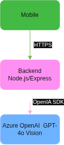

# DAT — Dossier d'Architecture Technique

## 1. Contexte et objectifs

Parcell-IA est une application mobile permettant aux agriculteurs de diagnostiquer des maladies végétales par simple prise de photo. L'IA analyse l'image et retourne un diagnostic (maladie détectée, niveau de risque, conseil actionnable) en quelques secondes.

**Contraintes :**
- Délai de réalisation : 3 jours (18h effectives)
- Démo fonctionnelle attendue — priorisation de la robustesse sur la complétude
- Hébergement via le tenant Azure de l'école

---

## 2. Vue d'ensemble de l'architecture



---

## 3. Composants techniques

### 3.1 Frontend — React Native (Expo)

| Élément | Choix |
|---|---|
| Framework | React Native avec Expo |
| Navigation | Expo Router |
| Appels API | fetch natif |
| Stockage token | SecureStore (Expo) |
| Caméra | expo-camera / expo-image-picker |

L'application cible iOS et Android depuis une base de code unique. Elle communique exclusivement avec le backend via HTTPS.

### 3.2 Backend — Node.js / Express

| Élément | Choix |
|---|---|
| Runtime | Node.js 20 LTS |
| Framework | Express 4 |
| Auth | JWT (jsonwebtoken) + bcrypt |
| ORM/DB | pg (driver natif PostgreSQL) |
| IA | openai SDK v4 (compatible Azure et OpenAI) |
| Conteneurisation | Docker (image node:20-alpine) |

Le backend expose une API REST sur le port 3000. Il est sans état (stateless) : toute la persistance est déléguée à PostgreSQL.

### 3.3 Base de données — PostgreSQL 16

Hébergée dans Docker en développement, migrée sur Azure Database for PostgreSQL ou comme sidecar Container App en production. Le schéma initial est chargé via `db/init.sql` au premier démarrage.

### 3.4 IA — Azure OpenAI GPT-4o Vision

Le service `aiProvider.js` envoie l'image en base64 au modèle multimodal GPT-4o. Le modèle retourne un JSON structuré (maladie, niveau de risque, conseil). Un fallback sur l'API OpenAI publique est prévu si le tenant Azure n'est pas disponible.

---

## 4. Infrastructure et déploiement

### Environnement local (développement)

```
docker-compose up
```

Lance deux conteneurs : `parcell-ia-backend` et `parcell-ia-db`. Les variables sensibles sont dans `.env` (non versionné).

### Environnement de production

| Ressource | Service Azure |
|---|---|
| Backend | Azure Container Apps |
| Base de données | PostgreSQL (sidecar ou managed) |
| IA | Azure OpenAI (tenant école) |
| DNS | parcell-ia.com → api.parcell-ia.com |
| TLS | Géré automatiquement par Azure Container Apps |

Le déploiement se fait par push d'image Docker sur Azure Container Registry puis mise à jour du Container App.

---

## 5. Sécurité

| Risque | Mesure |
|---|---|
| Accès non autorisé à l'API | JWT Bearer sur toutes les routes protégées |
| Mots de passe | Hashage bcrypt (coût 10) |
| Clés API IA | Variables d'environnement, jamais dans le code |
| Données en transit | HTTPS obligatoire en production |
| Images envoyées | Base64 en mémoire uniquement, non persistées sur disque |

---

## 6. Choix et alternatives écartées

| Sujet | Choix retenu | Alternative écartée | Raison |
|---|---|---|---|
| Frontend | React Native / Expo | Flutter | Compétences équipe |
| IA | Azure OpenAI GPT-4o | Modèle custom entraîné | Délai trop court |
| BDD | PostgreSQL | MongoDB | Données relationnelles, joins nécessaires |
| Auth | JWT stateless | Sessions Redis | Simplicité, pas de session serveur à gérer |
| Deploy | Azure Container Apps | VM classique | Scaling auto, gestion TLS intégrée |
